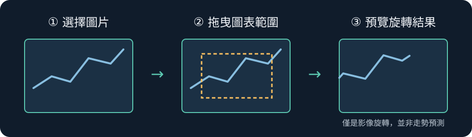

# Adam Double Reflection｜圖表雙重反射

把你選取的圖表區域**旋轉 180°**，即時預覽並另存圖片的桌面小工具。這是將舊版固定抓取 Yahoo 頁面的實驗腳本整理成一般人也能操作的圖片流程：不用 ChromeDriver、不用指定螢幕座標，也不用改程式碼。



> 反射圖只是一種影像對照方式，**不能用來預測市場走勢，也不是買賣訊號**。

## 如何使用

1. 安裝 [Python 3](https://www.python.org/downloads/)；Windows 安裝時勾選「Add Python to PATH」。
2. 下載這個倉庫，在倉庫資料夾開啟終端機，安裝圖片處理套件：

   ```powershell
   py -m pip install -r requirements.txt
   ```

3. 啟動視窗：

   ```powershell
   py app.py
   ```

4. 按「選擇圖片」，選擇你自己的 PNG、JPG、WEBP 或 BMP 截圖；在左圖拖曳想觀察的範圍。按「產生反射圖」即可預覽，最後按「另存反射圖」保存 PNG 或 JPG。不拖曳範圍時會處理整張圖片。

macOS／Linux 可將上述 `py` 改成 `python3`；若系統未安裝 Tk 圖形介面，需先依該系統的 Python 安裝方式加入 Tkinter。

## 程式做了什麼

- 保留選取範圍的像素尺寸，只作 180° 旋轉，對應舊版 `cv2.flip(image, -1)` 的效果。
- 左側顯示原圖與選取框，右側預覽結果；圖片只在你的電腦處理，不會上傳到服務。
- 支援重選範圍與另存檔案，取消開檔／儲存時不會覆蓋原圖。

主要程式在 [`app.py`](app.py)，圖片轉換與座標換算的檢查在 [`tests/test_app.py`](tests/test_app.py)。

原始 [`adam_double_reflection.py`](adam_double_reflection.py) 保留作開發歷程對照。它依賴當年的 Yahoo 頁面版型與固定螢幕座標，適合閱讀舊實驗，不建議作為現在的入門方式。
